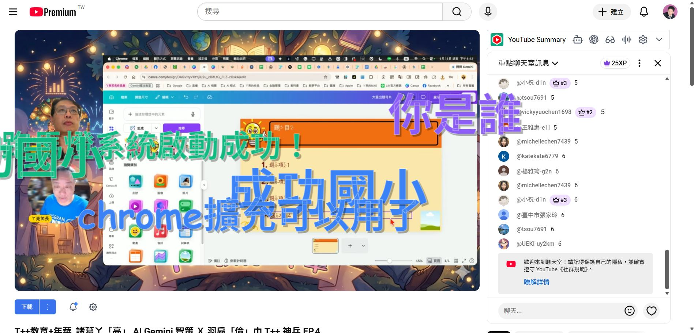

# 🍓 可愛網頁跑馬燈 (Cute Web Marquee)

這是一款專為網頁設計的 Chrome 擴充功能，可以將儲存在 Google 試算表（透過 Google Apps Script）中的文字，以繽紛、可愛的跑馬燈形式顯示在當前的網頁上。適合用於活動、教學或個人化網頁裝飾。

> 💡 **提示**：本專案同時包含一個**獨立網頁版**（`可愛跑馬燈控制中心.html`），如果您不想安裝擴充功能，也可以直接使用該 HTML 檔案。

## ✨ 特色功能

- **雲端同步**：串接 Google Apps Script (GAS)，隨時更新跑馬燈內容。
- **高度自定義**：可自由調整文字大小、顯示速度、重複次數。
- **隨機美感**：支援多色調色盤，文字顏色隨機切換。
- **Shadow DOM 技術**：採用 Shadow DOM 封裝樣式，不會干擾原網頁的 CSS 佈局。
- **一鍵清理**：支援從擴充功能直接清空雲端試算表資料。
- **訪客發文**：內建訪客發文網址產生器，方便他人投稿文字。



## 🛠️ 安裝方式

1. **下載原始碼**：下載本專案的所有檔案（或 Clone 此儲存庫）。
2. **開啟擴充功能管理面**：在 Chrome 網址列輸入 `chrome://extensions/` 並按下 Enter。
3. **啟用開發者模式**：勾選頁面右上角的「**開發者模式**」。
4. **載入擴充功能**：點擊左上角的「**載入解壓縮擴充功能**」，選擇本專案的資料夾（即包含 `manifest.json` 的資料夾）。
5. **固定擴充功能**：點擊瀏覽器工具列的拼圖圖示，將「可愛網頁跑馬燈」固定在工具列上以便使用。

## 🚀 使用說明

為了讓跑馬燈運作，您需要先完成 **Google Apps Script (GAS)** 的後端設定。

### 1. 取得並部署 GAS 後端

1. **開啟擴充功能**：點擊 Chrome 工具列上的「可愛網頁跑馬燈」圖示。
2. **複製程式碼**：在「GAS Web App 網址」欄位旁邊點擊 **「❓」說明按鈕**，然後點擊 **「📋 複製 GAS 程式碼」**。
3. **建立 Google 試算表**：前往 [Google 雲端硬碟](https://drive.google.com/)，建立一個新的「Google 試算表」。
4. **開啟指令碼編輯器**：在試算表中，點擊選單的「**擴充功能**」 > 「**Apps Script**」。
5. **貼上程式碼**：刪除編輯器中原本的所有程式碼，並貼上剛才從擴充功能複製的內容，按下存檔。
6. **部署網頁應用程式**：
   - 點擊右上角的「**部署**」 > 「**新部署**」。
   - 類型選擇「**網頁應用程式**」。
   - 「誰有權存取」務必選擇「**任何人**」。
   - 點擊部署，並複製產生的「**網頁應用程式 URL**」。

### 2. 設定擴充功能與啟動

1. **填回網址**：回到 Chrome 擴充功能視窗，將剛才複製的網址貼入「**GAS Web App 網址**」輸入框中。
2. **啟用功能**：勾選「**啟用跑馬燈功能**」。
3. **儲存設定**：點擊下方的 **「儲存並套用 ✨」**。
4. **開啟跑馬燈**：重新整理您想要顯示跑馬燈的網頁。

### 3. 開放訪客發文 (QR Code 分享)

1. **開啟發文網頁**：在擴充功能選單中，點擊 **「開啟訪客發文網址 ✨」** 按鈕。
2. **獲取 QR Code**：在彈出的新網頁中，點擊左上角的 **QR Code 圖示**，畫面上會顯示專屬的分享 QR Code。

   > 💡 **為什麼要讓大家掃這個 QR Code？**
   > 因為這個 QR Code 產生的網址已經「自動填好」了您的後台設定（GAS 網址）。參與者（如學生或觀眾）掃描後，**完全不需要手動貼上任何複雜的網址**，直接輸入內容就能發送。這讓大家省去設定的麻煩，拿起手機就能馬上互動！

3. **開始互動**：
   - 讓使用者（學生或觀眾）掃描該 QR Code，即可在手機或裝置上輸入文字。
   - 只要您的瀏覽器已啟用跑馬燈功能，訪客送出的文字就會即時以可愛跑馬燈的形式出現在您當前瀏覽的網頁上。

## 🎨 授權資訊

本工具由 [阿剛老師](https://kentxchang.blogspot.tw) 開發。
採用 **[CC BY-NC-SA 4.0 授權](https://creativecommons.org/licenses/by-nc-sa/4.0/deed.zh_TW)** (姓名標示-非商業性-相同方式分享)。

---

# 🖥️ 桌面彈幕工具（Python 版）

這是相同功能的 **Windows 桌面應用程式版本**，以 Python + PyQt6 開發。彈幕文字會直接飄過整個電腦螢幕桌面（覆蓋在所有視窗上方），滑鼠可正常點擊穿透，完全不影響電腦操作。

> 💡 **適用場景**：教室投影、直播展示、活動互動牆，讓訊息全螢幕飄過，比瀏覽器版更震撼！

## ✨ 功能特色

- **全螢幕彈幕**：文字以跑馬燈方式橫跨整個桌面，覆蓋所有視窗。
- **滑鼠穿透**：彈幕層完全透明，滑鼠點擊不受影響，可正常操作桌面。
- **雲端同步**：透過 Google Apps Script 串接 Google 試算表，即時取得訊息。
- **自動清空**：每次啟動程式時自動清空雲端資料，確保每場活動從零開始。
- **可調外觀**：字體大小、速度、重複次數、文字顏色皆可自訂。
- **浮動控制圓**：右下角圓形浮動圖示，一鍵開關彈幕、拖曳移動位置。
- **設定持久化**：所有設定自動儲存至 `marquee_settings.json`，下次開啟不須重設。

---

## 🔧 安裝說明

### 步驟一：安裝 Python

1. 前往 Python 官方網站下載安裝程式：**https://www.python.org/downloads/**
2. 下載 **Python 3.10 以上版本**（建議 3.11 或 3.12）。
3. 執行安裝程式時，**務必勾選「Add Python to PATH」**（新增至環境變數），否則後續指令將無法執行。

   

4. 安裝完成後，開啟「命令提示字元」（CMD）或「PowerShell」，輸入以下指令確認安裝成功：

   ```
   python --version
   ```

   若顯示類似 `Python 3.11.x` 即表示安裝成功。

---

### 步驟二：安裝必要套件

本工具需要以下兩個 Python 套件：

| 套件名稱 | 用途 |
|---|---|
| `PyQt6` | 繪製圖形介面與全桌面透明覆蓋層 |
| `requests` | 從 Google Apps Script 後端抓取彈幕資料 |

> **注意**：程式啟動時會自動嘗試安裝缺少的套件。若自動安裝失敗（例如網路限制或權限問題），請手動執行下列步驟。

開啟「命令提示字元」（CMD）或「PowerShell」，依序輸入以下指令：

```
pip install PyQt6
pip install requests
```

若 `pip` 指令找不到，請改用：

```
python -m pip install PyQt6
python -m pip install requests
```

或一次安裝所有套件（使用 requirements.txt）：

```
pip install -r requirements.txt
```

安裝過程中會自動下載所需的相依套件，請耐心等候（PyQt6 約 80–120 MB）。

---

### 步驟三：確認檔案齊全

下載後，請確認資料夾內包含以下檔案：

```
桌面彈幕工具/
├── desktop_marquee_v3.py     ← 主程式
├── requirements.txt          ← 套件清單
├── 啟動彈幕.bat              ← Windows 一鍵啟動捷徑
└── marquee_settings.json     ← 設定檔（第一次執行後自動產生）
```

---

## 🚀 啟動方式

### 方法一：雙擊批次檔（最簡單）

直接雙擊 **`啟動彈幕.bat`**，程式即會自動啟動。

> 若看到 Windows 安全性警告，點選「仍要執行」即可。

### 方法二：命令列啟動

開啟「命令提示字元」，切換至程式所在資料夾後執行：

```
cd "C:\你的資料夾路徑"
python desktop_marquee_v3.py
```

---

## 📋 使用流程

### 1. 設定 GAS 後端（第一次使用必做）

本工具的彈幕內容來自 Google 試算表，需先完成一次性後端設定：

1. 前往 [Google 雲端硬碟](https://drive.google.com/)，建立一份新的「Google 試算表」。
2. 在試算表選單點選「**擴充功能**」→「**Apps Script**」。
3. 刪除編輯器中所有原有程式碼，貼入以下 GAS 程式碼，按右上角存檔：

   <details>
   <summary>📋 點此展開 GAS 程式碼</summary>

   ```javascript
   function getSheet() {
     const ss = SpreadsheetApp.getActiveSpreadsheet();
     let sheet = ss.getSheetByName("跑馬燈資料");
     if (!sheet) {
       sheet = ss.insertSheet("跑馬燈資料");
       sheet.appendRow(["時間", "內容"]);
       sheet.getRange("1:1").setFontWeight("bold").setBackground("#dbeafe");
     }
     return sheet;
   }

   function doGet(e) {
     const sheet = getSheet();
     const data = sheet.getDataRange().getValues();
     data.shift();
     const result = data.map(row => ({ "時間": row[0], "內容": row[1] }));
     const callback = e.parameter.callback;
     const json = JSON.stringify(result);
     if (callback) {
       return ContentService.createTextOutput(callback + "(" + json + ")")
         .setMimeType(ContentService.MimeType.JAVASCRIPT);
     }
     return ContentService.createTextOutput(json).setMimeType(ContentService.MimeType.JSON);
   }

   function doPost(e) {
     const sheet = getSheet();
     const params = JSON.parse(e.postData.contents);
     if (params.action === "clear") {
       if (sheet.getLastRow() > 1) {
         sheet.getRange(2, 1, sheet.getLastRow() - 1, 2).clearContent();
       }
       return ContentService.createTextOutput("cleared");
     }
     sheet.appendRow([new Date(), params.content]);
     return ContentService.createTextOutput("success");
   }
   ```

   </details>

4. 點選右上角「**部署**」→「**新部署**」。
5. 類型選擇「**網頁應用程式**」。
6. 「誰有權存取」務必選擇「**任何人**」。
7. 點選「部署」，授權後複製產生的「**網頁應用程式 URL**」（格式類似 `https://script.google.com/macros/s/AKfyc.../exec`）。

---

### 2. 設定桌面彈幕程式

1. 啟動程式後，右下角會出現藍色圓形浮動圖示（顯示「彈幕」字樣）。
2. **左鍵單擊**圓形圖示，開啟設定面板。
3. 在「**GAS 網址**」欄位貼入剛才複製的網頁應用程式 URL。
4. 依需求調整以下設定：

   | 設定項目 | 說明 |
   |---|---|
   | 啟用桌面彈幕 | 開關切換，關閉後彈幕暫停但程式持續運行 |
   | 字體大小範圍 | 最小／最大字體（px），每條彈幕隨機取值 |
   | 速度範圍 | 最慢／最快速度，每條彈幕隨機取值 |
   | 重複次數 | 每條訊息在螢幕上跑過幾次後消失 |
   | 顏色設定 | 5 個自訂顏色，彈幕隨機從中挑選 |

5. 點選「**儲存設定**」完成設定。

---

### 3. 訪客發文（觀眾輸入彈幕）

讓觀眾或學生透過手機輸入文字發送彈幕：

1. 開啟隨附的 **`可愛跑馬燈控制中心.html`** 檔案（直接雙擊或用瀏覽器開啟）。
2. 預設畫面為「**學生發文頁面**」，輸入 GAS 網址後即可送出訊息。
3. 如需查看彈幕畫面，在網址後加上 `?mode=teacher` 參數即可切換至教師控制畫面。
4. 將學生發文頁面的網址製作成 QR Code 分享給觀眾，他們掃描後即可直接輸入文字。

---

### 4. 自動清空說明

每次啟動程式時，系統會在啟動後約 0.8 秒自動清空 Google 試算表中的舊資料，右下角會短暫顯示「已清空雲端資料」提示。

如需手動清空，可在設定面板點選「**清除雲端資料**」按鈕。

---

## ❓ 常見問題

**Q：程式啟動後沒有看到彈幕？**
> 請確認設定面板中「啟用桌面彈幕」已開啟，且 GAS 網址已正確填入並儲存。另外，試算表中需有資料才會顯示彈幕。

**Q：安裝 PyQt6 失敗？**
> 請確認 Python 版本為 3.10 以上，且網路連線正常。若在公司或學校網路環境，可能需要設定 Proxy。可嘗試：
> ```
> pip install PyQt6 --trusted-host pypi.org --trusted-host files.pythonhosted.org
> ```

**Q：程式顯示「GAS 請求失敗」？**
> 請確認 GAS 部署時「誰有權存取」設定為「任何人」，且網址格式正確（結尾為 `/exec`）。

**Q：如何完全關閉程式？**
> 設定面板沒有關閉按鈕（避免誤觸），請在 Windows 工作列找到程式圖示後右鍵點選「關閉」，或在工作管理員中結束 `python.exe` 程序。

**Q：彈幕文字出現亂碼？**
> 請確認系統已安裝「Microsoft JhengHei（微軟正黑體）」字型，這是 Windows 內建字型，一般不需額外安裝。

---

## 🎨 授權資訊

桌面彈幕工具（Python 版）由 [阿剛老師](https://kentxchang.blogspot.tw) 開發。
採用 **[CC BY-NC-SA 4.0 授權](https://creativecommons.org/licenses/by-nc-sa/4.0/deed.zh_TW)** (姓名標示-非商業性-相同方式分享)。

